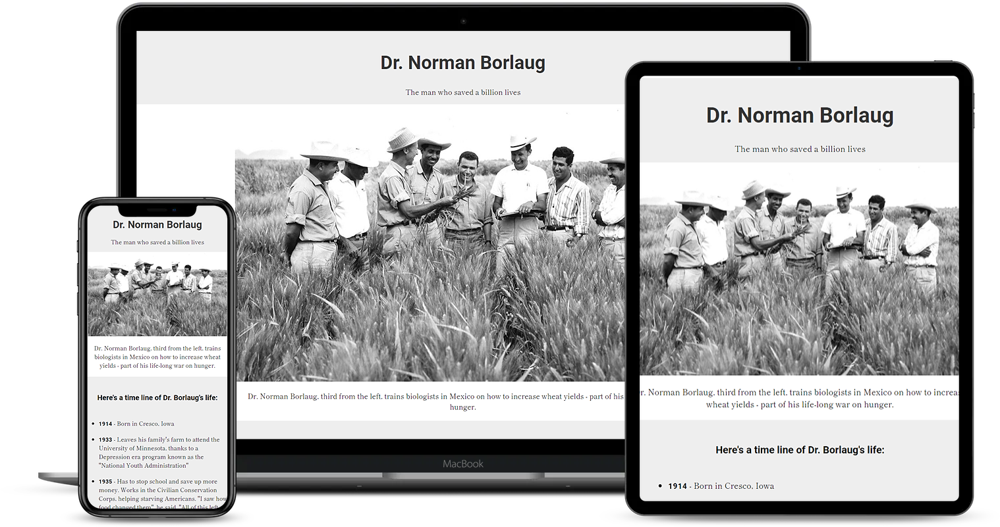

# Página de Tributo - FREE CODE CAMP

Para finalização do curso de Web Design Responsivo do curso da Free Code Camp foram apresentados 5 projetos como testes finais, sendo a página de tributo a primeira dos cinco testes, nele foi trabalhado questões importantes para estilização utilizando o CSS, como por exemplo: box model que consiste em entender como se trabalha com margins, border e paddings de maneira correta, também foi muito trabalho centralização, tipografia e comportamento do layout quando exposto a tamanhos de telas diferentes, sendo necessário a implementação de media queries para quebra de layout, e ajuste de tipografia em dispositivos mobile.

---

## Design

